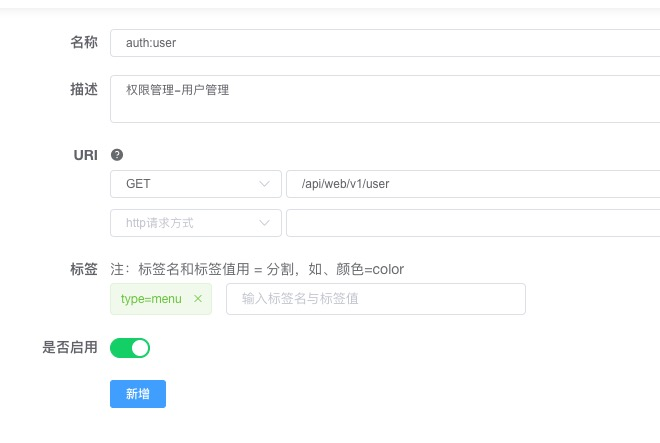

<!-- START doctoc generated TOC please keep comment here to allow auto update -->
<!-- DON'T EDIT THIS SECTION, INSTEAD RE-RUN doctoc TO UPDATE -->
**Table of Contents**  *generated with [DocToc](https://github.com/thlorenz/doctoc)*

- [介绍](#%E4%BB%8B%E7%BB%8D)
    - [技术选型](#%E6%8A%80%E6%9C%AF%E9%80%89%E5%9E%8B)
    - [概念](#%E6%A6%82%E5%BF%B5)
    - [处理流程](#%E5%A4%84%E7%90%86%E6%B5%81%E7%A8%8B)
- [使用说明](#%E4%BD%BF%E7%94%A8%E8%AF%B4%E6%98%8E)
    - [分配域](#%E5%88%86%E9%85%8D%E5%9F%9F)
    - [使用案例](#%E4%BD%BF%E7%94%A8%E6%A1%88%E4%BE%8B)
    - [第三方接入](#%E7%AC%AC%E4%B8%89%E6%96%B9%E6%8E%A5%E5%85%A5)
- [安装教程](#%E5%AE%89%E8%A3%85%E6%95%99%E7%A8%8B)
    - [后端服务](#%E5%90%8E%E7%AB%AF%E6%9C%8D%E5%8A%A1)
    - [前端服务](#%E5%89%8D%E7%AB%AF%E6%9C%8D%E5%8A%A1)
    - [访问测试](#%E8%AE%BF%E9%97%AE%E6%B5%8B%E8%AF%95)
    - [打包部署](#%E6%89%93%E5%8C%85%E9%83%A8%E7%BD%B2)
- [QA](#qa)

<!-- END doctoc generated TOC please keep comment here to allow auto update -->


# 介绍

<div align="center"></div>
doorkeeper是一个可扩展的认证管理平台，可以在此平台上快速接入权限管理，(不是认证授权框架 Shiro\Spring Security)，但可以集成认证授权框架一起使用。

这是一个独立的权限配置管理服务的脚手架，用于将登录认证、权限验证、权限管理从业务中抽离，便于业务系统快速接入权限功能。

> 通过定义资源，通过名称、uri、标签等方式进行查找，平台会基于配置的策略和权限告诉调用方拥有权限的资源。
> 调用方基于返回数据则可以实现，api控制、菜单控制等，而权限处理逻辑从业务中抽离，便于业务系统快速接入权限功能。

### 技术选型
- Vue、ElementUI 前端组件库；
- SpringBoot Spring全家桶作为应用主框架；
- jwt 令牌认证；
- MyBatis、MyBatisPlus DAO层；
- MySQL 持久化关系数据库；

### 概念


- **域** :   
  域表示独立的一块区域，域与域之间的所有数据是隔离的，如用户等。Doorkeeper属于特殊的域，用于数据管理操作。
  域secret是用于域用户登录时候进行认证处理使用的。

- **用户/用户组** :   
  用户/用户组在域下唯一，一个用户可以加入多个用户组。用户/用户组都可以进行角色绑定。
  
- **委托方** :   
  根据项目需求，委托方可以是一个模块，也可以是一个项目。比如，定义域为仓储项目，那么委托方可以是库位模块等。
  
- **角色** :   
  可以给域或者委托方创建角色，主要用于绑定后的权限鉴定。
  
- **资源** :   
  资源是一个最小的认证单位，可以通过URI，也可以通过名称或者标签进行定义，平台提供了相应的搜索功能。
  比如定义一组资源为菜单，资源名称为菜单ID，用户可以通过搜索是否有对应ID的资源权限来达到菜单访问的能力。
  
- **策略** :   
  策略是通过不同权限访问的规则定义。
    
   > 目前策略类型有： 1. 角色 2. 用户 3. 用户组 4. 参数
     
- **权限** :   
  权限其实就是真正定义资源和访问策略的绑定关系的一个模型。
  
### 处理流程


核心的思想就是根据调用参数，找到需要认证的资源，通过不同的权限策略流程后返回可访问的资源。

# 使用说明

### 分配域

域的数据是完全隔离的，在设计初衷就是希望内部只部署一套doorkeeper服务，来为多个业务方提供服务。可以给doorkeeper域的用户分配多个域的操作权限来管理其他域的资源、角色等创建，
对于非doorkeeper域的用户来说，他们只关心资源的认证。对于不同项目组，可以分配不同的doorkeeper用户，他们自行创建域，就可以达到配置隔离的目的。
目前权限只控制到域级别，没有对更细的操作进行配置，更加详细的配置可以通过自定义扩展实现。


在doorkeeper域的用户组可以发现父级为realm的用户组，子组名称都是域的名称 （**_新增域的时候会创建_**）。当前的逻辑中，只要将用户加入对于的域名的用户组，刷新页面即可在右上角切换新增的域。


这里具体的实现就直接使用了doorkeeper整套处理流程来实现。当新增一个域的时候，doorkeeper域下会新增一个client并且名称就是对应域名。
同时增加对应uri资源、角色、策略和权限，并绑定对应的用户组。具体实现可以从上图进入对应域的client来查看。

### 使用案例

 这里使用例子实现一个菜单和api的权限认证。
 1. 创建委托方
 2. 创建菜单资源
    
    名称是唯一编码，可用于前端标识，对于用户管理这个菜单，只要授予权限，则默认拥有用户列表接口的访问权限。定义标签`type=menu`表示告诉前端这个是一个菜单资源。
 
 3. 创建按钮资源
    
    这是一个按钮操作控制，`type=fn`表示告诉前端这个是功能而不是菜单。
    
 4. 创建策略/权限
    可以创建一个用户策略绑定对应的测试用户，然后再使用此策略创建一个权限绑定对应的资源，实现资源访问的能力。
    
 目前前端就可以根据权限返回，控制页面渲染，而且业务方也可以在具体服务或者网关配置拦截，进行资源认证，达到接口权限的访问控制。   
    
 > ps: 可以设置一个资源为默认权限，然后把对所有人开放的api配置进去，并通过默认角色绑定，分配给所有人。
 
### 第三方接入

1. 接口文档
```
http://host:port/api-docs.html
```

2. 请求参数

```
请求接口时，额外带上Header
Authorization:   登录后获取到的token
```

# 安装教程

### 后端服务

1. 初始化数据库
   
    执行脚本 `init/init-table.sql`，导入初始数据。
    
2. 修改配置文件

    注意修改`spring.datasource`配置，修改数据库名与用户名、密码。
    
3. 启动Java后端服务

    通过命令行启动Java后端服务，命令类似`java -jar doorkeeper.jar` 。

    `doorkeeper.jar` 位于 `doorkeeper-server/target` 目录下。 

    > 此步骤需要JDK8及以上版本

4. 调用Java服务初始化接口
   
    Doorkeeper域的数据通过代码进行初始化，需在启动Java服务后访问初始化接口。该接口在Doorkeeper部署后访问一次即可。

    ```
    http://host:port/api/init
    ```

    假设Java服务所在机器(容器)IP地址为`127.0.0.1`，Http服务端口配置为`8088`，初始化接口为`http://127.0.0.1:8088/init` 。

    初始账户 admin admin

### 前端服务

1. 启动Node前端服务 
    
    `vue`目录下执行 `npm install`安装依赖，然后通过`npm run build`编译前端资源，编译完成后的前端静态资源在`vue/dist`目录中。
   
    本地调试可以使用 `npm run serve` 启动前端服务，`vue/vue.config.js`中可以指定前端项目端口，默认为8082。

    > 此步骤需要先安装NodeJs服务

2. 配置Nginx代理服务器

    假设Nginx与Java后端服务在同一机器上，后端服务启动为`8088`端口。
    
    ```
        server {
            listen 80;
                
            # Doorkeeper服务域名可自行设置，或使用 doorkeeper.limbo.org
            server_name doorkeeper.limbo.org;
       
            # A 前端静态资源代理，如果采用 npm run build 方式对前端资源进行编译，使用此方法代理前端
            location / {
                # 编译产生的静态资源目录 vue/dist
                root /path/of/dist;
                autoindex on;
                autoindex_exact_size on;
                autoindex_localtime on;
            }
            
            # B 前端Node服务代理，如果采用 npm run serve 方式启动前端服务，使用此方法代理前端 
            location / {
                proxy_pass http://127.0.0.1:8082/;
            }
              
            # 后端Java服务代理
            location /api/ {
                # 后端接口
                proxy_pass http://127.0.0.1:8088;
            }
        }
    ```
   
   > 前端代理的方式 A B 选择一种即可。建议生产环境使用A方式，将Nginx作为前端服务器，利用Nginx的缓存、gzip等；开发环境使用B方式，可以实现修改前端代码后热更新，便于调试。
    
### 访问测试

管理端访问，进行登录
    
访问 `http://doorkeeper.limbo.org`，以默认用户名`admin`密码`admin`登录Doorkeeper管理平台，进行配置。

假设Nginx服务所在服务器地址为`10.10.10.10`，需配置DNS解析，将`doorkeeper.limbo.org`(或自己的其他域名)映射到该IP。

如果没有DNS解析，可在需访问Doorkeeper管理平台的机器`hosts`文件中添加一行`10.10.10.10 doorkeeper.limbo.org`
    
### 打包部署

1. 前端打包
    通过`npm run build`编译前端资源，可以参考上文nginx配置使用nginx托管静态资源。还可以将静态资源直接放到doorkeeper-server/src/main/resources/static目录下，打包到jar中由java进程提供访问能力。

2. Java服务打包
      
   项目根目录下，执行如下命令打包编译，通过`-P`参数指定环境，如开发环境为`-P dev`

   ```
   mvn clean package -Dmaven.test.skip=true -P dev
   ```

   > 此步骤需要先安装maven


# QA

- 如何修改默认用户名密码？
  
  默认用户名密码在 `DoorkeeperService.initDoorkeeper` 方法中设置，可以自行修改。需在第一次启动Java服务前修改，修改完后编译、运行Java服务。

  ```java
    // 创建管理员账户
    User user = new User();
    user.setRealmId(realm.getRealmId());
    // 设置默认用户名 admin
    user.setUsername(DoorkeeperConstants.ADMIN);
    user.setNickname(DoorkeeperConstants.ADMIN);
    // 设置默认密码 admin
    user.setPassword(MD5Utils.md5WithSalt(DoorkeeperConstants.ADMIN));
    user.setIsEnabled(true);
    userMapper.insert(user);
  ```
 
  如已完成初始化，此时建议只修改密码，可登陆管理平台后进行修改。
